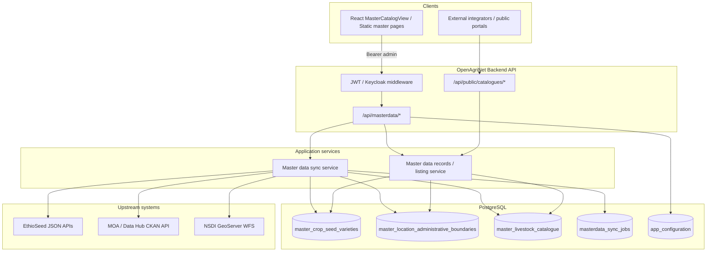
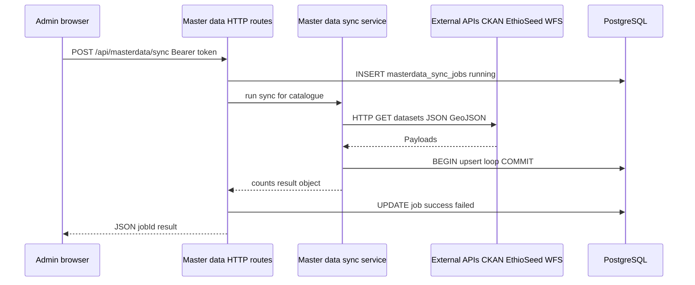
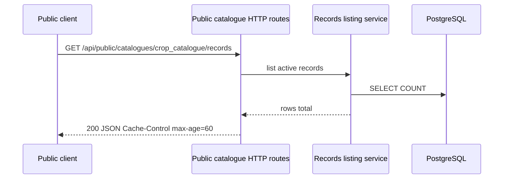

# Software Design Specification — Master Data Catalogues (Crop, Location, Livestock)

## Acronyms

| Acronym | Meaning |
|--------|---------|
| **API** | Application Programming Interface |
| **AWS** | Amazon Web Services |
| **CI/CD** | Continuous Integration and Continuous Deployment |
| **CKAN** | Comprehensive Knowledge Archive Network (open data portal software) |
| **CRUD** | Create, Read, Update, Delete |
| **DDL** | Data Definition Language (database schema statements) |
| **GeoJSON** | Geographic JSON (encoding of geographic data structures) |
| **HTTP / HTTPS** | Hypertext Transfer Protocol (Secure) |
| **ILIKE** | SQL case-insensitive pattern match (PostgreSQL) |
| **JSON** | JavaScript Object Notation |
| **JSONB** | Binary JSON storage type (PostgreSQL) |
| **JWT** | JSON Web Token |
| **MITM** | Man-in-the-middle (attack class) |
| **MOA** | Ministry of Agriculture (Ethiopia, in upstream data context) |
| **NSDI** | National Spatial Data Infrastructure |
| **OpenAPI** | Machine-readable HTTP API description standard (formerly Swagger) |
| **P-code** | Place code: stable identifier for an administrative location in national or humanitarian datasets |
| **REST** | Representational State Transfer (HTTP-oriented API style) |
| **SDS** | Software Design Specification |
| **SQL** | Structured Query Language |
| **TLS** | Transport Layer Security |
| **UUID** | Universally Unique Identifier |
| **WAF** | Web Application Firewall |
| **WFS** | Web Feature Service (OGC interface, often used for boundary data) |

## Executive summary

OpenAgriNet's **master data catalogues** provide authoritative reference data for **crops and registered seed varieties**, **administrative locations** (including optional boundary geometry), and **livestock species** with optional programme metadata. This specification covers **three catalogues only**: `crop_catalogue`, `location_catalogue`, and `livestock_catalogue`. Data is synchronized **on demand** from configured national sources (for example EthioSeed, MOA and Data Hub CKAN, and NSDI GeoServer WFS where applicable), stored in PostgreSQL with **stable keys** so platform UUIDs do not churn when upstream rows are refreshed. Administrators manage catalogues through **authenticated REST APIs** and supporting UIs (React workflow and optional static pages); **public read-only REST APIs** expose the same three lists to integrators under stricter pagination and short HTTP cache lifetimes.

The design is **layered and synchronous**: HTTP routes, dedicated sync and listing services, relational storage with upsert semantics, optional admin SQL views, identity integration via JWT and Keycloak for privileged operations, and deployment through **automated CI/CD** to AWS (**`staging`** branch to staging, **`master`** to production). The document sets out business context, architecture, data and API design, user experience, security and performance considerations, testing guidance, and DevOps expectations—including **rollback by reverting the branch and pushing** to re-trigger deployment—while explicitly excluding other catalogues, scheduled sync, deep coupling to farmer/land/livestock transactional registries, and formal approval or versioning workflows unless the programme adds them later.

---

This specification defines the **master data catalogue** capability in OpenAgriNet **only** for the three catalogues named **`crop_catalogue`**, **`location_catalogue`**, and **`livestock_catalogue`**. It describes behaviour, interfaces, and design intent for that scope. Technology examples (Express, PostgreSQL, React) reflect the intended implementation stack unless stated otherwise.

---

## Introduction

### Purpose of this section/module

The master data module provides a canonical, database-backed reference layer for crops and registered seed varieties, administrative location boundaries (with optional geometry), and livestock species with optional programme metadata. It answers two operational needs:

- Administrators can refresh these lists from trusted national sources and curate gaps with local rows.
- Downstream features and external integrators can read stable catalogue content through HTTP APIs without duplicating upstream integration logic in every client.

### Scope

#### Included

This module supports ingestion (synchronization) from configured external systems into three PostgreSQL tables, using upsert semantics keyed by `(source_system, source_catalogue, source_record_key)` to ensure that OpenAgriNet UUID primary keys remain stable. It provides admin-only REST APIs for listing records (with search and pagination), as well as creating, updating, and deleting entries, in addition to triggering synchronization processes and inspecting sync job status and results. Public read-only REST APIs are also exposed for the same three catalogues, with stricter pagination limits and HTTP caching headers applied to optimize performance. Administrative configuration of external system base URLs is supported via the `app_configuration` table under the `masterdata` group. User interface support includes an admin UI implemented within the React workflow (`MasterCatalogView`), along with a parallel static HTML/JavaScript implementation under the `/frontend/` directory that enables the same operations. Additionally, SQL views are provided to expose a reduced column set to support simplified and legacy administrative read use cases.

#### Excluded

This specification excludes any master catalogue not explicitly defined within the scope, including other registries or any future catalogues. Automated or scheduled synchronization is not supported, as all sync operations are triggered on demand via API. Transactional integration with other registries, such as farmer, land, or livestock modules, is also out of scope; while these modules may consume UUIDs or reference codes, their integration is not covered within this SDS. Field-level governance workflows, including approval processes, versioning, and historical audit tracking, are not included. Furthermore, although the `masterdata_sync_jobs.deactivated_count` column exists within the schema, the current implementation does not support a deactivation workflow, and this field is not populated during the synchronization process.

### High-level functionality

Administrators authenticate, open a master catalogue screen, **search and page** through active rows, **sync** from upstream (EthioSeed for crop, CKAN/WFS stack for location, CKAN discovery with optional seed list for livestock), **add** rows tagged with `local.openagri.net`, **edit** active rows, or **delete** rows (hard delete). The backend fetches remote JSON or GeoJSON over HTTP/HTTPS, normalizes records, computes a **row hash** to detect changes, and issues `INSERT ... ON CONFLICT ... DO UPDATE` within a database transaction per catalogue batch. Public clients call a single GET endpoint per catalogue to retrieve JSON pages for integration or public portals.

---

## Business Context / Requirements

### Business goals this section supports

The module supports **data harmonization** across the platform by centralizing reference lists that would otherwise be retyped or forked in each subsystem. It aligns with **government data reuse** by pulling from Ministry of Agriculture and related national portals (EthioSeed, MOA CKAN, NSDI GeoServer) while still allowing **local supplementation** where upstream coverage is incomplete. Stable identifiers reduce broken joins when sync runs repeatedly.

### User stories / use cases

A **national administrator** needs to refresh crop and seed variety data before a planting season campaign so loan and extension workflows offer consistent crop names. A **GIS or registry administrator** needs woreda-level (and, where present in upstream data, zone- and region-level) administrative boundaries together with **P-codes** and parent linkage so farmer and land records can be checked against official geography: the same code a user enters or selects should match the boundary and name held in the location catalogue. A **livestock programme owner** needs a species list for dashboards even when CKAN discovery is flaky, relying on the built-in seed list as a baseline. An **external system integrator** needs a **read-only JSON API** to populate dropdowns in a partner portal without Keycloak accounts. A **super user** needs to **override** upstream base URLs when endpoints move, without redeploying application binaries.

**P-codes (place codes)** are stable identifiers for administrative locations, widely used in Ethiopian and humanitarian spatial datasets to refer to a specific administrative unit without ambiguity. In the `location_catalogue`, **`p_code`** identifies the row (and typically feeds **`source_record_key`** when the upstream feed supplies a code); **`parent_p_code`** ties a child unit to its parent in the administrative hierarchy (for example a woreda to its zone) when that relationship is available from the synchronized boundary data; **`name`** carries the official or common label for display and search. Together, these fields let programmes validate addresses, drive cascaded location pickers, and join registry data to a single national location reference, independent of spelling variations in free-text place names.

### Functional requirements

The system must **validate** catalogue names on every route (`crop_catalogue`, `location_catalogue`, `livestock_catalogue`, or `all` for sync only). It must **record** each sync attempt in `masterdata_sync_jobs` with status `running` then `success` or `failed`, timestamps, optional `source_query` payload, and inserted/updated counts (aggregated when `all` is selected). It must **list** active rows with optional `q` search, returning `total` for pagination. It must **create** admin rows with `source_system = local.openagri.net` and generated or supplied `source_record_key`. It must **reject** malformed JSON in `attributes` or `geometry_geojson` fields with `400` where parsing is required. It must **return** `409` on duplicate `(source_system, source_catalogue, source_record_key)` on create. It must **expose** public GET endpoints without authentication, clamping `limit` to 100 and setting `Cache-Control: public, max-age=60`.

### Non-functional requirements (performance, security, scalability)

**Performance:** Sync uses bounded HTTP timeouts (`MASTERDATA_HTTP_TIMEOUT_MS`, with shorter effective timeouts for some hosts), optional `LOCATION_MAX_RECORDS`, and livestock-specific caps (`LIVESTOCK_RESOURCE_TIMEOUT_MS`, `LIVESTOCK_MAX_BODY_BYTES`, limits on CKAN `package_search` rows, `package_show` calls, resource fetches, and maximum stored records). Location resolution prefers the MOA open-data portal (`data.moa.gov.et`) before the National Agricultural Data Hub (`datahub.moa.gov.et`), because the hub is often less reachable or slower outside Ethiopia. **Security:** Admin routes require a Bearer token (OpenAgriNet JWT or verified Keycloak access token) and role `admin` or `super`. Public catalogue endpoints are intentionally unauthenticated; they must not be relied on to protect sensitive personal data (they expose reference rows, including geometry JSON for locations). Upstream HTTPS clients may disable strict TLS certificate validation for legacy government hosts, which **weakens TLS verification** relative to default browser behaviour and must be weighed in deployment threat models. **Scalability:** Sync runs **inline** in the HTTP request that triggers it unless a future design moves it to a worker; long-running syncs occupy an application worker and hold a database transaction per catalogue batch. Horizontal scaling of the API tier may require sticky behaviour or externalizing sync to a job queue if that pattern is adopted later. Read paths scale with PostgreSQL and a shared connection pool.

---

## System Context

### Where this module fits in the overall system

The module sits in the **OpenAgriNet HTTP API layer** (master data routes and public catalogue routes) backed by **PostgreSQL**. Administrators reach it through the **React workflow** (dedicated sections for crop, location, and livestock master data), which renders the **MasterCatalogView** experience only when the portal role is Admin or Super User. A **static HTML/JavaScript** deployment path exposes equivalent catalogue operations where plain hosting is used. Downstream domain modules (registries, reporting) are expected to **consume** these catalogues by UUID or codes; this specification treats the master data subsystem as the **source of truth** for the three named catalogues only.

### Dependencies on other modules/services

The catalogue APIs depend on **authentication and admin-role enforcement** middleware, which in turn depends on **`JWT_SECRET`** (or equivalent) for application JWTs and **Keycloak** verification for realm access tokens. Sync depends on **`app_configuration`** rows in group `masterdata` and on the **database connection pool**. Shared utilities provide **deterministic row hashing** (canonical stringification and SHA-256) for change detection.

### External systems involved (APIs, third parties)

**EthioSeed** (`ethioseed_base_url`, default `https://ethioseed.moa.gov.et`): JSON endpoints `/api/crops-catalog` and `/api/varieties-catalog` for crop/seed sync. **MOA CKAN** (`ckan_base_url`, default `https://data.moa.gov.et`): `package_show` for the `ethiopian-administrative-boundary` dataset to discover a GeoJSON/WFS URL; also used in livestock discovery. **National Agricultural Data Hub CKAN** (`datahub_base_url`, default `https://datahub.moa.gov.et`): secondary CKAN mirror for location URL discovery and livestock search. **Ethiopian NSDI GeoServer WFS** (`ethionsdi_wfs_base_url`): fallback `GetFeature` in GeoJSON for layer `geonode:eth_woreda_2013` (stored or discovered URLs that reference the deprecated `eth_adm2` typename are normalized to the supported layer). Livestock sync may label `source_system` as `data.moa.gov.et` or `datahub.moa.gov.et` depending on which CKAN root yielded JSON, or `openagrinet.masterdata.seed` when using the embedded fallback list.

---

## Architecture Design

### High-level architecture diagram (for this section)

### Design pattern used (e.g., microservice, layered, event-driven)

The implementation follows a **monolithic layered** style: **HTTP routes** orchestrate validation and HTTP status mapping, **services** encapsulate sync and querying, and **PostgreSQL** enforces uniqueness and stores JSON attributes. There is **no message bus** in this design; sync is **synchronous** from the caller’s perspective (the admin POST waits until sync finishes or errors). The public slice is a **read model** over the same tables, with **optional HTTP caching** via a `Cache-Control` header suitable for edge caches.

### Component breakdown

**Master data HTTP routes** implement admin sync, job lookup, legacy view-based list, full-record CRUD, and configuration updates for allowed URL keys. **Public catalogue HTTP routes** implement the unauthenticated read API with catalogue allowlisting. **Master data sync service** implements the three catalogue sync flows plus orchestration when `all` is requested, outbound HTTP helpers, URL normalization, and transactional upsert loops. **Master data records service** centralizes physical table resolution, SQL `ILIKE` search with escaping, total row counting, and ordering. **MasterCatalogView (React)** is the primary interactive admin UI. **Static master catalogue client** mirrors core behaviour for HTML-first hosting. **Database DDL** defines tables, indexes, admin views, and default configuration seeds for the `masterdata` group.

---

## Component Design

### Responsibility

**Master data routes** authenticate administrators, parse JSON bodies for CRUD, compute per-catalogue **row hashes** for locally authored rows, map catalogue names to SQL views or base tables, and return consistent `{ success, error?, ... }` JSON shapes. **Sync service** owns all network I/O to third parties, resilience (timeouts, fallbacks, partial JSON detection), and **idempotent upsert** of remote rows. **Records service** owns safe pagination and **search** semantics shared by admin and public endpoints. **UI** owns presentation, debounced search, paging controls, modals for documentation and data-source explanation, and client-side validation of JSON text fields before submit.

### Inputs / outputs

**Sync input:** HTTP POST body `{ "catalogue": "crop_catalogue" | "location_catalogue" | "livestock_catalogue" | "all", "sourceQuery"?: ... }` (extra fields may be stored on the job row as JSON). **Sync output:** JSON with `jobId`, `elapsed_ms`, and `result` object; for `all`, `result` nests `{ crop, loc, livestock }` each with counts (livestock may also return `seedFallback`, `discoveredRecords`, `sourceSystem` where applicable). **List input:** Query `limit`, `offset`, optional `q`. **List output:** `data` array of full rows (admin) or active rows (public), `total`, echoed `q`. **CRUD input:** JSON fields per catalogue (see API section). **CRUD output:** Row on success, error message on failure.

### Interfaces

**Inbound:** HTTP on paths under the `/api` prefix. **Outbound:** HTTPS/HTTP to EthioSeed, CKAN `api/3/action/*`, and WFS GeoJSON URLs; PostgreSQL via parameterized queries. **UI to API:** Authenticated `fetch` (or equivalent) with a Bearer token for admin operations; session or token handling is provided by the host application shell. Static pages typically read the token from configured browser storage keys agreed with the deployment.

### Internal logic (if necessary)

**Crop sync** loads crops and varieties in parallel, joins on seed/crop id, builds `attributes` as the raw variety object, and hashes payload fields to skip pointless updates. **Location sync** resolves a GeoJSON FeatureCollection URL, maps diverse property names to `p_code`, `name`, `parent_p_code`, derives `level`, uses `p_code` as `source_record_key` when present else hashes properties, stores geometry as JSONB, and may truncate features if `LOCATION_MAX_RECORDS` is set. **Livestock sync** searches CKAN with a small query set, inspects JSON-looking resources only, concatenates arrays up to `LIVESTOCK_MAX_RECORDS`, maps flexible field names, and falls back to curated seed rows if discovery yields nothing. **Search** builds an `ILIKE` pattern with `%`, `_`, and `\` escaped and matches across primary text columns plus `attributes::text`.

---

## Data Design

### Data models / schemas

Each catalogue row shares a common **master data pattern**: UUID `_id`; provenance columns `source_system`, `source_catalogue`, `source_record_key` (unique per system/catalogue); typed business columns per domain; `attributes` JSONB for upstream payload or extensions; `row_hash` for change detection; `source_updated_at`; `is_active`; audit `created_at` / `updated_at`. **Crop** adds variety, crop, producer, seed supply notes. **Location** adds `level`, `p_code`, `name`, `parent_p_code`, `geometry_geojson`. **Livestock** adds species names and three programme text fields.

### Database tables or collections

**`master_crop_seed_varieties`**, **`master_location_administrative_boundaries`**, **`master_livestock_catalogue`** — physical tables with unique constraints on `(source_system, source_catalogue, source_record_key)` and partial indexes on `is_active`. **`masterdata_sync_jobs`** — job log with `catalogue`, `status`, JSON `source_query`, counts, `last_error`. **`app_configuration`** — key/value rows, subset exposed via `/api/masterdata/config`. **Views:** `vw_admin_master_crop_seed_varieties`, `vw_admin_master_location_administrative_boundaries`, `vw_admin_master_livestock_catalogue` filter `is_active = TRUE` and hide internal columns for the simpler `GET /api/masterdata/:catalogue` endpoint.

### Data flow within the module

**Upstream → DB:** Sync HTTP GET → parse → build in-memory record list → optional row-hash pre-scan for metrics → `BEGIN` → per-row upsert → `COMMIT`. **DB → Admin UI:** UI requests `/api/masterdata/:catalogue/records` → service queries table with `is_active = TRUE` → JSON to browser. **DB → Public:** Same query path with stricter `limit` and response caching header. **Admin UI → DB:** POST/PUT/DELETE mutate base tables; local inserts set `source_system` to `local.openagri.net`.

### Validation rules

Catalogue parameter must match allowlists. `attributes` and optional geometry must parse as **JSON objects** (not arrays) on admin writes. `limit`/`offset` are clamped to safe ranges. Public `limit` is between 1 and 100 inclusive. Search string is trimmed and truncated to **200 characters** before pattern use. Duplicate keys on insert yield HTTP **409**. Updates apply only where `_id` matches and `is_active` is true; otherwise **404**.

---

## API Design

### Endpoints

| Method | Path | Auth | Purpose |
|--------|------|------|---------|
| POST | `/api/masterdata/sync` | Admin Bearer | Run sync for one catalogue or `all`; creates job row |
| GET | `/api/masterdata/sync-jobs/:jobId` | Admin Bearer | Fetch job status row |
| GET | `/api/masterdata/:catalogue` | Admin Bearer | Legacy read via SQL view (`limit`≤500) |
| GET | `/api/masterdata/:catalogue/records` | Admin Bearer | Full rows, search, `limit`≤500 |
| POST | `/api/masterdata/:catalogue/records` | Admin Bearer | Create (local source unless overridden upstream) |
| PUT | `/api/masterdata/:catalogue/records/:id` | Admin Bearer | Update active row by UUID |
| DELETE | `/api/masterdata/:catalogue/records/:id` | Admin Bearer | Hard delete by UUID |
| GET | `/api/masterdata/config` | Admin Bearer | Read masterdata URL configuration |
| PUT | `/api/masterdata/config` | Admin Bearer | Batch update allowed keys |
| GET | `/api/public/catalogues/:catalogue/records` | None | Public paged read (`limit`≤100) |

### Request/response structures

Responses generally follow `{ success: boolean, error?: string, ... }`. List endpoints add `catalogue`, `count`, `total`, `data`, `limit`, `offset`, and `q` echo when searching. Sync success returns `jobId`, `catalogue`, `elapsed_ms`, `result`. Configuration PUT expects `{ "updates": [{ "config_key", "config_value" }] }` filtered to `ckan_base_url`, `datahub_base_url`, `ethioseed_base_url`, `ethionsdi_wfs_base_url`. Detailed field lists for public responses may be maintained as separate **API description** or OpenAPI artefacts under programme document control; they are not exhaustively reproduced in this SDS.

### Authentication/authorization

**Admin APIs:** `Authorization: Bearer <token>`. Token may be an HS256 application JWT (`JWT_SECRET`) or a validated Keycloak RS256 access token mapped to roles; only **`admin`** and **`super`** satisfy admin-only routes. **Public APIs:** no auth; catalogue name validated against a fixed set.

### Error handling

Typical status codes: **400** invalid catalogue or bad JSON; **401** missing/invalid token on admin routes; **403** authenticated but not admin; **404** unknown job or record on update; **409** unique violation on create; **500** unexpected server/database errors with generic JSON error messages and server-side application logging. Sync failures mark the job `failed` with `last_error` text and return **500** with `{ success: false, error: 'Sync failed', jobId }` so the client can correlate.

---

## User Interface Design

### Screens / wireframes

The React **MasterCatalogView** presents a **breadcrumb**, title, short description, **authoritative source** line, a toolbar (`Sync from source`, `Refresh`, `Add local row`), **search** field with debounce, **page size** selector (25/50/100), a **data table** of configured display columns, **pagination** (First/Previous/Next/Last), row-level **Edit** and **Delete**, and modals for **data source info**, **public API documentation** (endpoint, query parameters, example cURL, reference to companion API docs), **sync success** acknowledgement, and **create/edit** forms. The **static** master pages (crop, location, livestock) provide a simpler layout with the same conceptual elements and a dedicated client script for catalogue operations.

### User interactions

Search triggers reload after a short debounce (on the order of hundreds of milliseconds). Pagination resets when the search string changes. Sync shows inserted/updated counts from the API payload and highlights when livestock used the **seed fallback**. Saving validates JSON for `attributes` and GeoJSON for location geometry. Delete asks for browser confirmation and warns that sync may re-import upstream rows if they still exist.

### Validation and UX rules

Only **Admin** and **Super User** portal roles may access master catalogue sections in the workflow shell. Forms coerce empty strings to `null` for optional scalar fields. Object fields must remain JSON objects. Geometry is optional but must parse if non-empty. In-product API help states the public `limit` maximum (100) for integrators.

---

## Sequence Flows / Workflows

### Key flows (e.g., “User submits form → validation → API → DB”)

**Admin refresh:** UI ensures session/token → `GET .../records?limit&offset&q` → PostgreSQL `SELECT` + `COUNT` → table render. **Admin create:** Client JSON validation → `POST .../records` → `INSERT` with `local.openagri.net` → `201` + row → table reload. **Admin sync:** `POST /api/masterdata/sync` → insert job `running` → sync service performs external HTTP + DB upserts → update job `success` / `failed` → JSON response → UI reload table. **Public read:** `GET /api/public/catalogues/{catalogue}/records` → same listing logic without auth → CDN/browser may cache up to 60 seconds per `Cache-Control`.

### Sequence diagrams for critical operations

**On-demand sync (single catalogue):**

**Public catalogue read:**

---

## Security Design

### Authentication & authorization

Administrative operations require a valid **Bearer** token and an application role of **admin** or **super** after JWT verification or Keycloak realm role mapping. Public catalogue endpoints are **anonymous by design**. **Application-level rate limiting** for public catalogue traffic is **not applicable currently** in this specification; mitigations may be applied at an API gateway, reverse proxy, or WAF if the programme requires them.

### Data protection (encryption, masking)

Data at rest follows **PostgreSQL** and infrastructure choices (volume encryption, disk policies). In transit, clients should use **HTTPS** in production. Upstream sync clients may relax strict TLS certificate validation for legacy government hosts; that is a documented compatibility trade-off. Catalogue rows may include **geometry** and programme text; they are not masked in API responses.

### Threat considerations

**Unauthenticated access** to public endpoints may allow bulk download of national reference data; programme-level controls may throttle or monitor that traffic. **Admin token theft** grants sync and CRUD power, including hard deletes and URL reconfiguration affecting data integrity. **Relaxed upstream TLS** increases MITM risk for sync payloads compared to strict verification. **SQL injection** risk is mitigated by parameterized queries; dynamic table names must be chosen only from an internal map keyed by validated catalogue strings. **Large JSON bodies** are partially bounded for livestock resource fetches; other paths rely on standard framework body limits and database robustness.

---

## Performance & Scalability

### Expected load

The module is intended for **moderate** admin concurrency and **bursty** sync (large GeoJSON downloads for national boundaries). Public reads may issue **two SQL statements per request** (list + count), which doubles read load under heavy pagination.

### Bottlenecks

**Synchronous sync** ties up an application worker for as long as upstream calls and database upserts take; very large feature collections and per-row upsert loops are CPU and I/O intensive. **Exact count** with search on every page load may slow as tables grow; **estimated counts, caching, or materialized views are not applicable currently** unless introduced in a later release. **Geometry JSON** can be large, increasing response sizes for location public API consumers.

### Scaling strategy (horizontal/vertical, caching, queues)

**Vertical** scaling (faster database, more CPU) and **HTTP caching** (`max-age=60`) on public reads address typical growth. **Horizontal** API replication remains compatible with stateless application instances sharing one database. A **background worker or job queue** for sync is a plausible future improvement but is **not applicable currently** as a required part of this SDS.

---

## Testing Strategy

### Unit tests

**Automated unit tests** dedicated to the master data sync service, record listing service, and HTTP routes are **not applicable currently** within the scope of this specification (no mandated suite is defined here). When a programme introduces them, high-value targets include pure normalization helpers (array extraction from heterogeneous JSON, administrative level mapping, search-pattern escaping), URL normalization for WFS/CKAN discovery, and **stable hashing** of canonicalized payloads so upsert skip logic remains correct across releases.

### Integration tests

**Automated integration tests** (end-to-end against a real database and mocked upstream HTTP) are **not applicable currently** as a normative requirement of this SDS. A recommended programme-level suite would cover: schema and views present; sync **idempotency** and insert/update counts; admin **401/403** on protected routes; public **`limit`** clamping; and search behaviour for special characters in `q`. Those tests would use disposable PostgreSQL instances, seeded `app_configuration`, and stub EthioSeed/CKAN/WFS responses.

### Edge cases

Empty upstream arrays for crop; CKAN timeout falling through to NSDI WFS for location; livestock discovery yielding zero JSON rows (seed fallback); duplicate manual `source_record_key`; concurrent sync requests creating multiple jobs; very large geometry payloads on PUT; token expiry mid-session in the admin UI.

### Test data requirements

Minimal `app_configuration` rows for the `masterdata` group; synthetic CKAN `package_show` payloads with a resource URL pointing at a controlled GeoJSON fixture; small EthioSeed-shaped JSON fixtures (crops and varieties); livestock JSON arrays with inconsistent field naming to exercise field mapping.

---

## Deployment & DevOps

### Build and deployment process

The programme uses **automated build and CI/CD**. Pushes to the **`staging`** branch trigger the pipeline and deploy to the **staging environment on AWS** (application stack, supporting services, and assets as defined in the pipeline). Pushes to the **`master`** branch trigger deployment to **production** on AWS. Each run performs build steps and promotes artefacts to the target environment according to the shared workflow configuration and secrets (for example SSH, registry, or orchestrator credentials) held outside this specification.

### CI/CD considerations

Branch-to-environment mapping is fixed for routine releases: **`staging` → staging (AWS)**, **`master` → production (AWS)**. Environment variables for sync timeouts, livestock limits, database connectivity, identity provider endpoints, and **`JWT_SECRET`** (or equivalent) must be supplied per environment in the deployment target or secret store, not committed into application source. Database schema changes should be coordinated with migrations or DDL steps included in or invoked by the pipeline where applicable.

### Rollback strategy

For application releases delivered through this CI/CD model, **rollback** is performed by **moving the branch back to a known-good commit** (reverting or resetting `HEAD` to the last good revision) and **pushing** that state so the **same automated action runs again** and redeploys the previous version to the affected environment. If a bad release included **destructive database changes**, rollback of the application must be complemented by a **database restore or forward-fix migration** according to operations procedures; the master data **sync job log** remains useful for correlating failed versus successful sync runs by `jobId`.

---

## Document control

| Item | Value |
|------|--------|
| Scope | `crop_catalogue`, `location_catalogue`, `livestock_catalogue` only |
| Logical components | Master data HTTP routes; public catalogue HTTP routes; master data sync service; master data records/listing service; React MasterCatalogView; static master catalogue UI; PostgreSQL tables and admin views |
| Companion material | Programme-controlled API descriptions (e.g. OpenAPI or markdown) for public catalogue endpoints; master data catalogue narrative docs as maintained by the programme |

This SDS defines intended behaviour and design for the named scope. Where implementation details differ in a given deployment, the **controlled release** and **operations runbooks** for that environment take precedence.
